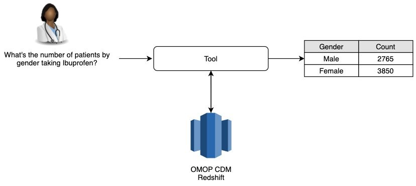

# Nostos

<u>N</u>avigate <u>O</u>MOP-<u>s</u>tructured data via <u>t</u>ext-t<u>o</u>-<u>S</u>QL (NOSTOS)

## Poster

[Poster PDF](./Poster/poster.pdf)

## Code

https://github.com/amazon-research/nl2sql-omop-cdm

## Data

User-generated questions and the corresponding SQL templates to train and test the machine learning model. ([Data folder](./Data/))

## Abstract

<b>Machine Learning-assisted query and information retrieval system on real-world data</b>

Miguel Romero Calvo 1, Yupeng Li 2, Tesfagabir Meharizghi 1, Weilin Meng 2, Selvan Senthivel 1, Saman Sarraf 1, Lin Lee Cheong 1

1. Amazon ML Solutions Lab, Amazon, Santa Clara, CA, USA
2. Merck & Co., Inc., Kenilworth, NJ, USA

### Background

Real-world data (RWD) are increasingly useful for healthcare providers, payors, regulators, and pharmaceutical companies to gather information and make decisions. However, the retrieval of such information requires specialized technical knowledge, resulting in delays and gaps. This work aims to increase information accessibility by creating a medical Natural Language to SQL (NL2SQL) tool that non-technical users can use to easily query RWD (Figure 1). Although many studies explored the general NL2SQL models 1-8, they cannot be directly applied to query medical data because medical records are often stored using specific medical ontologies, e.g. insomnia is recorded as an ICD10 code, G47.00. It requires intermediate steps to recognize medical terms in natural language and convert to desired medical codes, before querying the data. Many of these ontologies are hierarchical, thus long queries are needed to get the complete set of medical codes by querying all relevant medical codes, e.g. all the descendants of a converted code. But long queries can negatively impact the performance of a machine-learning (ML) model. Additionally, different institutes often use different medical ontologies and data structures to record the data. Our model is built on the Observational Medical Outcomes Partnership (OMOP) common data model (CDM), a widely adapted and standardized medical ontology and data structure, and thus can be applied across institutes and data sources.

Figure 1: Tool functionality diagram

### Methods

We process text into executable SQL queries by leveraging Amazon Comprehend Medical (CM), template-based text-to-SQL ML models and OMOP CDM in the following sequential process:

1. CM and custom entity recognition rules identify and classify the parts of the sentence necessary to compose the query or need to be disambiguated into medical codes. The parts of the sentence are then replaced by key arguments (E.g. \<ARG-DRUG\><0> for the first drug occurrence) to create a generic query.
2. CM disambiguates drug and conditions names into RxNorm and ICD10CM codes respectively. Users can inspect the disambiguation and modify the code as desired. Arguments such as gender or race are disambiguated into OMOP concepts.
3. Generic queries are then passed to a NL2SQL model that converts the queries into SQL queries with the key arguments. This allows the ML model to be independent of any change in medical ontologies.
4. Generic queries are rendered with pre-defined sub-queries that map RxNorm and ICD10CM codes detected by CM to standard OMOP concepts. The rendered queries can be executable on any RWD based on OMOP CDM.

### Results

Evaluation was conducted through a survey with 39 healthcare professionals. Results show that 95% of them would be interested in the tool. This percentage increases to 100% for the 38% of users who rarely or never use querying tools. Moreover, users report that retrieving information takes more than 10 minutes over 80% of the time. The presented semi-automated tool reduces the retrieval time to 1 to 3 minutes and achieves a SQL query matching and execution accuracy of 99% for in-scope during training.

### Conclusions

This work demonstrates the utility of ML-human integrated systems to query OMOP-CDM SQL databases with natural language. The tool enhances information access by increasing the scope to non-technical users and reducing information retrieval times.

### References

[1] Bogin, Ben, Matt Gardner, and Jonathan Berant. "Representing schema structure with graph neural networks for text-to-sql parsing." arXiv preprint arXiv:1905.06241 (2019).

[2] Guo, Tong, and Huilin Gao. "Content enhanced bert-based text-to-sql generation." arXiv preprint arXiv:1910.07179 (2019).

[3] Li, Ning, Bethany Keller, Mark Butler, and Daniel Cer. "SeqGenSQL--A Robust Sequence Generation Model for Structured Query Language." arXiv preprint arXiv:2011.03836 (2020).

[4] Lin, Xi Victoria, Richard Socher, and Caiming Xiong. "Bridging Textual and Tabular Data for Cross-Domain Text-to-SQL Semantic Parsing." arXiv preprint arXiv:2012.12627 (2020).

[5] Shi, Peng, Patrick Ng, Zhiguo Wang, Henghui Zhu, Alexander Hanbo Li, Jun Wang, Cicero Nogueira dos Santos, and Bing Xiang. "Learning Contextual Representations for Semantic Parsing with Generation-Augmented Pre-Training." arXiv preprint arXiv:2012.10309 (2020).

[6] Wang, Ping, Tian Shi, and Chandan K. Reddy. "Text-to-SQL Generation for Question Answering on Electronic Medical Records." In Proceedings of The Web Conference 2020, pp. 350-361. 2020.

[7] Xu, Xiaojun, Chang Liu, and Dawn Song. "Sqlnet: Generating structured queries from natural language without reinforcement learning." arXiv preprint arXiv:1711.04436 (2017).

[8] Yu, Tao, Rui Zhang, Kai Yang, Michihiro Yasunaga, Dongxu Wang, Zifan Li, James Ma et al. "Spider: A large-scale human-labeled dataset for complex and cross-domain semantic parsing and text-to-sql task." arXiv preprint arXiv:1809.08887 (2018).
